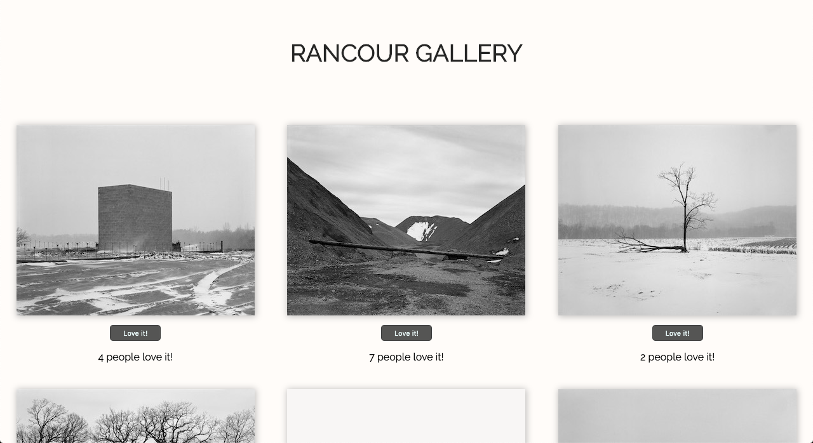
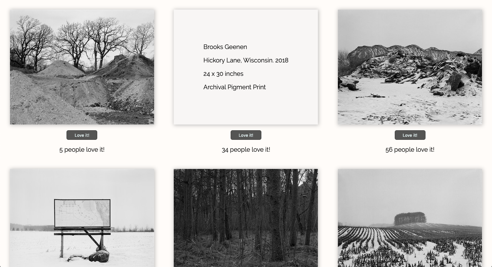

# Rancour Gallery

## Description

This is a gallery template for photographers and visual artists. It uses a simple flexible grid system that allows individuals to focus on the portfolio of work. Clicking on the image(s) allows users to view a description of the piece, creating less clutter, and more focus on the portfolio. Users are also able to "like" a portfolio item via the "Love it!" button which increments the global total and updates it for all users. The content seamlessly and dynamically scales depending on the user's viewport size.

## Technologies Used

- React
- Javascript
- Node
- Express
- Axios
- HTML
- CSS

## Project Images

### Header
 

### Mid-Page

## Installation

- Visit Heroku at
- https://rancour-gallery.herokuapp.com/

## Contact

- Brooks Geenen
- brgeen@gmail.com

